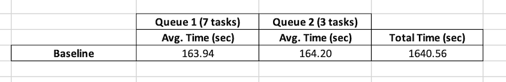

# Celery Investigation


## Goal

The goal with this repo is to investigate, test, and compare different configurations for Celery in order to try to improve performance by reducing the total time spent running a set of tasks.

For this purpose we are assuming the tasks have some characteristics:
   - They are I/O bound: the time it takes to complete a computation is determined mainly by the period it spends waiting for input/output operations;
   - They are long running: they spend a couple minutes running to acomplish their purpose

## Requirements

For running all the components you might need to add the root of this repo to you pythonpath on each shell you use to run a component.

```
$ export PYTHONPATH=$PYTHONPATH:/full/path/to/repo/root
```

It is also recommended to create a python virtual environment and install the dependencies there.

```
$ python -m venv .venv
$ source .venv/bin/activate
$ pip install -r requirements.txt
```

## Structure

To be able to achieve the tasks characteristics mentioned above and test the different configurations we have implemented the following structure.

### webserver
This is a simple fastapi server with an endpoint that, upon request:
   - Randomly choses a value between 180 and 210 seconds;
   - Sleeps for that amount of seconds;
   - Inserts a record containing the id, the sleep time in seconds and total request time in secods;
   - Returns an http response containing the same data from the previous step;

### utils
This is a package with some utilities such as a small client to request data from the webserver, logging configuration and helper functions.

### waitinator
This is a celery application configured with 2 queues, a producer and the consumer implementations.
The consumer implements 2 different types of tasks:
   - `waitinate`: this task fires up a request to the webserver, parses the response, inserts a record into an sqlite database and returns a dictionary with collected data and measurements;
   - `summarize`: this task expects a list of dictionaries (outputs from `waitinate` tasks) to summarize and insert a record into an sqlite database
The producer submits 2 chords (for most of the tests run):
   - 1 chord containing `7 waitinate` tasks as header tasks and a `summarize` task as the callback task;
   - 1 chord containing `3 waitinate` tasks as header tasks and a `summarize` task as the callback task;

### reporter
This is a package with a python script that loads recorded raw data for cpu and memory usage, parses it, cleans it and outputs a json file with the cleaned data, as well as a graphic representation of the data for each of the monitored PIDs.

## Running
If you intend to run/experiment by yourself, assuming you have rabbitmq and redis installed in your machine, you will need:
   - A shell for running rabbitmq as the broker: in my case, on macos:
   ```
    $ CONF_ENV_FILE="/opt/homebrew/etc/rabbitmq/rabbitmq-env.conf" /opt/homebrew/opt/rabbitmq/sbin/rabbitmq-server
   ```
   - A shell for running redis as the backend result:
   ```
   $ redis-server
   ```
   - A shell for running the webserver/api:
   ```
   $ python webserver/run.py
   ```
   - A shell for running the consumer (with the various configurations):
   ```
   celery -A waitinator.tasks worker --loglevel=info --without-gossip --without-mingle
   ```
   - A shell for running the producer:
   ```
   python waitinator/producer.py
   ```

## Tests and Results

The followed "methodology" was to run the consumer with a set of configurations, run the producer, collect the data and store the sqlite databases of that run for analysis.

For the initial tests we ran the base case where we have:
   - worker_prefetch_multiplier set to 1
   - worker_concurrency set to 1
   - worker_pool set to default (prefork)
This constitutes our baseline for further comparison.

The other runs, for which the databases and results are stored under the results folder, tested the following variations:
   - Concurrency: Without changing any other setting, we varied the number of concurrent processes under the worker
   - Process Pool: Also with the different number of concurrent processes we also varied the process pools
      - gevent
      - eventlet

<br>
<br>

### Baseline


### Concurrent Processes - Average Times


### Concurrent Processes - Total Times


The total time is being calculated as `MAX(end_timestamp) - MIN(start_timestamp)` for all tasks from both chords, meaning it represents the time
for finish running both chords.


## Discussion

It looks clear that for long running, I/O bound tasks there is a gain in increasing concurrency for the celery worker.

For all different pool types
and number of concurrent processes it presented an improvement by reducing the total execution time, eventhough the running time per task might have been increased.


The `"worst" observed improvement` was for `prefork with 2 processes`, decreasing the total execution time by `38%` when compared to the baseline.

The `"best" observed improvement` was for `gevent with 16 processes`, decreasing the total execution time by `87.1%` when compared to the baseline.

It is important to notice all the tabled results might be subjected to some fluctuation due to the fact the webserver (and other machine processes) are
running in the machine and might vary on CPU/Memory consumption and I/O delays, but the experiment gives as a general idea of the possible improvements we
might achieve in production if we are willing to test and find the "sweetspot" of concurrency/pool configuration for our scenario.

### Observations

One possible downside is that, for being able to run celery with gevent and eventlet, I had to:
   - Set `broker_heartbeat = 0`, otherwise some tasks would miss the heartbeat and be re-run, while celery would also log some warning messages;
   - Run celery from the shell, not being able to use the `celery_app.main_worker_main(..)` approach from a python script. When trying to do so the celery
   worker would receive a couple tasks and hang, not running any tasks.


## Further testing

We decided to re-run the tests and further investigate:
   - Memory and CPU usage impacts when using different pools and levels of concurrency;
   - Number of connections to the backend result and to the message broker

The results and discussions are detailed in the [monitoring documentation page](docs/monitoring.md).